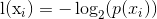
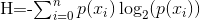

### 概念

> 决策树, 本质上是一种规则系统, 基于数据的一致程度(香农熵), 来划分数据层级, 进而辅助决策判定

#### 优点
1. 计算简单, 数据结果易于理解

#### 缺点
1. [todo]过度匹配问题

#### 问题
1. 如何解决过度匹配问题

#### 核心公式

* 
* 

解读1. 定义信息,即符号xi,的信息量。直白的说, 就是发生的概率越小, 贡献的信息量越大

解读2. 对可能的所有符号(决策树中为分类), 计算其信息量的总和, 也就是说, 信息量越大分类越差

#### 延伸阅读
