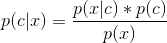
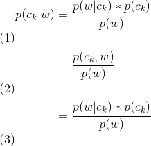
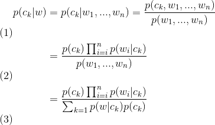

### 概念

> 朴素贝叶斯, 可以用来解决分类的判定问题。其内在的思路为利用`条件概率`进行贝叶斯推断。

#### 优点
1. 不需要很多样本, 也可以进行良好的工作

#### 缺点
1. 对样本数据较为敏感
2. 在维度很高或某维下值很多, 模型表现较差

#### 问题

#### 核心公式

解读1. 基础的条件概率公式

解读2. 对公式一的推导

解读3. 在假设特征独立的情况下, 如何计算`未分类样本`在`给定分类`下的概率

#### 延伸阅读

1.  [朴素贝叶斯WIKI](https://en.wikipedia.org/wiki/Naive_Bayes_classifier)